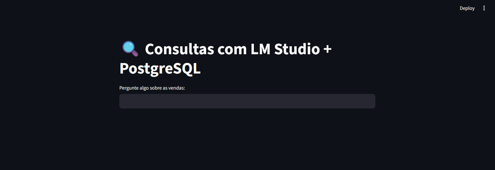

# Projeto Chatbot com LM Studio e Postgres 

 

<!-- TABLE OF CONTENTS -->
<details open="open">
  <summary>Indície</summary>
  <ol>
    <li>
      <a href="#objetivo">Objetivo</a>
      <ul>
        <li><a href="#bibliotecas-utilizadas">Bibliotecas utilizadas</a></li>
      </ul>
    </li>
    <li>
      <a href="#arquivos">Arquivos</a>
    </li>
    <li>
      <a href="#rodando-o-projeto">Rodando o projeto</a>
    </li>
    <li>
      <a href="#sobre">Sobre</a>
    </li>
  </ol>
</details>

## Objetivo

Este projeto tem como objetivo desenvolver um chatbot inteligente que permite a interação em linguagem natural com um banco de dados <b>PostgreSQL</b>, utilizando tecnologias modernas de inteligência artificial (IA) e processamento de linguagem natural (PLN).

A aplicação é construída em <b>Python</b> e integra-se ao <b>LM Studio</b>, uma plataforma local que possibilita o uso de modelos de linguagem de grande porte (LLMs) diretamente no ambiente do desenvolvedor. O <b>LM Studio</b> atua como intermediador entre o usuário e o banco de dados, realizando a conversão de comandos em linguagem natural para instruções SQL por meio do modelo <b>sqlcoder-7b-2</b>, previamente baixado e carregado na plataforma.

O modelo <b>sqlcoder-7b-2</b>, desenvolvido com foco em tarefas de geração de SQL, é responsável por interpretar perguntas feitas em português ou inglês e transformá-las em consultas SQL precisas, permitindo que o usuário acesse, filtre ou manipule os dados do banco de forma intuitiva e eficiente.

Além disso, o projeto também envolve a configuração de um ambiente de banco de dados robusto com <b>PostgreSQL</b>, permitindo a execução real das queries geradas e o retorno das respostas ao usuário em formato legível.

O resultado é uma solução prática, acessível e local (sem depender da nuvem), ideal para analistas, desenvolvedores e profissionais que desejam explorar dados com o apoio de IA, sem a necessidade de escrever código SQL diretamente.


<!-- programas-e-bibliotecas -->
### Bibliotecas utilizadas

Nele foi implementado as seguintes bibliotecas:

* streamlit
* psycopg2-binary
* pandas
* plotly
* requests
* python-dotenv

<!-- arquivos-e-pastas -->
## Arquivos

A estrutura física contém o arquivo <b>app.py</b> que é o arquivo da estrutura funcional do projeto, o arquivo <b>test_connect_bd.py</b> realiza teste de conexão com o banco de dados. 

O arquivo <b>docker-composer.yml</b> contém a estrura para a criação do docker que irá conter o <b>Postgres</b>.

No arquivo <b>requirements.txt</b> são as dependências do projeto, as bibliotecas.

O script <b>init.sql</b> contém comandos para criar tabelas e inserir dados no <b>Postgres</b>, o arquivo <b>criando_ambiente_virtual.txt</b> é um tutorial para criar um ambiente virtual no <b>Python</b>. 

Para que o projeto possa rodar é preciso renomear o arquivo <b>.env_example</b> para <b>.env</b> e inserir as chaves nele descrito.

<!-- rodando-o-projeto -->
## Rodando o projeto

Para rodar o projeto dentro do diretório raiz no prompt digite:
```
streamlit run app.py
``` 
<!-- sobre -->
## Sobre

Autor: Thiago Vilarinho Lemes <br>
LinkedIn <a href="https://www.linkedin.com/in/thiago-v-lemes-b1232727">Thiago V. Lemes</a><br>
e-mail: contatothiagolemes@gmail.com | lemes_vilarinho@yahoo.com.br


